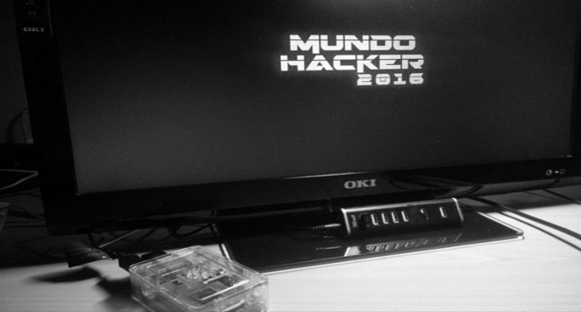
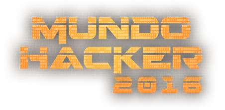

# Deception PI

DecepcionPI is a project based on analyzing SSH attacks on a honeypot installed on Raspberry PI. This project was made for [RetoISACA 2016](http://www.isaca.org/chapters7/madrid/aboutourchapter/jovenes-profesionales/pages/reto.aspx). The idea was to create a honeynet with two Cowrie sensors in Spain (Granada and Madrid) sending the information to a centralized server to get access to more data. Using this data we can analyze the tendencies and metodologies of attacks worldwide and the kind of malware is trending in real time.

## Who we are

<a href="https://github.com/juanvelascogomez">@juanvelascogomez</a> and <a href="https://github.com/0d4rujd">@0d4rujd</a>

## The webpage

You can visit our project in by clicking [here](http://deceptionpi2016.tk/).

## Features

We have done some studies and data analysis, this are some of the things you can find in our project. Hope you like it!

**1. Data and information**: STUDING THE INFORMATION AND THE DATA WE WERE RECEVING IN REAL TIME

**2. Graphic analysis**: ANALYZING INFORMATION IN A VISUAL WAY WAS A PRIORITY FOR US

**3. Daily mail resume**: A QUICK DAILY MAIL VIEW ABOUT HOW ARE THE HONEYPOTS RESPONDING

## Hope you like it!!!

If you do, give us feedback! {:)
